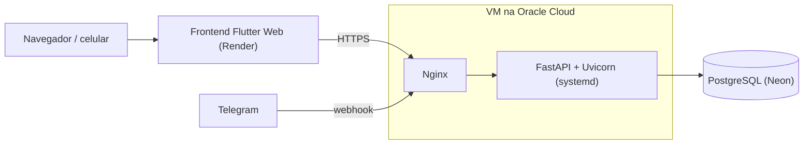

# Smart-Sheet

Controle e análise de banca, no navegador e no celular.

Smart-Sheet é uma aplicação web e mobile de controle e análise de banca. Nasceu de uma planilha que eu mantinha à mão pra acompanhar minhas apostas esportivas (lançamentos, lucro, ROI, quanto havia em cada casa) e virou um sistema completo, com login, dashboard, filtros por período, gráficos e um bot do Telegram que registra os lançamentos. É só uma ferramenta de acompanhamento: não faz aposta nem movimenta dinheiro. Hoje é usado por mim e por dois amigos, cada um com a sua conta.

> **Testar o app:** _(coloque o link aqui)_

<!--
Quando tiver prints, salve em docs/img/ e tire os comentários abaixo.

## Como ele é


-->

## O que dá pra fazer

### Registrar apostas

Existem três caminhos:

- **Formulário no app**: casa de apostas, descrição, odd, valor apostado, retorno, resultado e tipster (de quem veio a indicação). Também aceita apostas turbinadas, com aumento no lucro.
- **Importando uma planilha Excel**, pra trazer o histórico que já existia.
- **Pelo bot do Telegram**, que lê a mensagem da dica e cria a aposta sozinho (explico melhor mais abaixo).

### Lista de apostas

As apostas aparecem agrupadas por dia, com paginação. Dá pra filtrar por casa, tipster, status e período (atalhos prontos ou um calendário pra escolher qualquer intervalo), e também buscar por texto.

Dois gestos deixam o uso rápido no celular:

- arrastar o card pra **esquerda** exclui a aposta;
- arrastar pra **direita** muda o status. Um arrasto curto oferece uma opção e um arrasto mais longo oferece a outra (por exemplo, numa aposta em aberto: curto vira green, longo vira red). O card muda de cor enquanto você arrasta, então dá pra saber onde soltar.

Tocar no botão de status também alterna entre aberto, green e red.

### Dashboard

O número grande é o lucro do período escolhido, e logo abaixo fica a banca que o usuário definiu, com o valor de 1% dela ao lado (útil pra dimensionar as apostas). Tudo na tela respeita o filtro de período:

- ROI, taxa de acerto, odd média, ticket médio, apostas em aberto e total investido;
- gráfico de evolução da banca e lista de lucro por dia;
- resumo por casa e resumo por tipster, pra comparar o que está rendendo mais.

### Saques e depósitos

Uma tela com duas abas. Na de **depósitos** dá pra ver quanto foi colocado em cada casa e quanto sobra da banca fora delas (se o total passar da banca, o valor fica negativo, o que mostra quanto saiu do bolso). A de **saques** ajuda a acompanhar quanto tem disponível em cada casa. Com isso dá pra saber onde está o dinheiro sem entrar em cada site.

### Modo mensal (opcional)

Quem quiser pode ligar uma visão por ciclos: ao iniciar um novo mês, o painel "zera" e mostra só o que aconteceu dali em diante, com o histórico dos meses anteriores guardado. Quem não liga continua com o app normal.

### Outros detalhes

- Cada usuário só enxerga e altera os próprios dados.
- Tela de carregamento animada, feita à mão em Flutter (sem pacote de animação).
- Dá pra instalar como app direto pelo navegador (PWA) e também gerar um APK pra Android.

## Bot do Telegram

O bot serve pra não precisar digitar cada aposta.

1. No app, o usuário gera um código de 6 dígitos (vale 10 minutos).
2. Manda esse código pro bot e a conta fica vinculada ao chat.
3. A partir daí, é só colar a mensagem da dica: o bot identifica casa, confronto, mercado e odd, calcula o valor a apostar e registra a aposta como "em aberto". Ele responde confirmando o que foi lançado.

Os grupos de dicas mandam o valor de jeitos diferentes, então o bot entende mais de um formato: percentual da banca (respeitando o limite máximo, quando a mensagem traz um), unidades (com o valor da unidade configurável) ou o valor já calculado na própria mensagem. Quando o formato é igual entre dois tipsters, dá pra escrever o nome dele numa linha antes da mensagem pra a aposta ser marcada corretamente.

Também tem dois comandos de configuração, mandados direto no chat:

- `% = 20` define que 1% da banca vale R$ 20 (ou seja, banca de R$ 2.000);
- `Unidade = 4` muda o valor de 1 unidade pra R$ 4.

O Telegram avisa a API por webhook, e a chamada só é aceita se vier com o token secreto configurado.

## Tecnologias

| Parte | O que foi usado |
|---|---|
| API | Python, FastAPI, SQLAlchemy, Pydantic, Uvicorn |
| Banco | PostgreSQL (Neon). Em desenvolvimento local cai num SQLite sozinho |
| App | Flutter / Dart (web e Android), fl_chart pros gráficos |
| Integrações | Telegram Bot API, openpyxl (importação de Excel), httpx |
| Servidor | VM na Oracle Cloud (Ubuntu), Nginx, systemd, HTTPS com Let's Encrypt |
| Deploy | GitHub Actions (backend) e Render, site estático (frontend) |

## Como está no ar



O backend roda numa VM da Oracle Cloud que eu mesmo configurei: instalei as dependências, liberei as portas (na rede da Oracle e no firewall do Ubuntu), coloquei o Nginx como proxy reverso na frente da API, emiti o certificado HTTPS e deixei o serviço gerenciado pelo systemd, que sobe a aplicação junto com a máquina e reinicia se ela cair. As chaves e senhas ficam num arquivo `.env` fora do repositório.

O banco é um PostgreSQL gerenciado, então não preciso cuidar de backup nem de manutenção dele.

### Deploy automático

- **Frontend:** a cada push, o Render gera o build e publica o site.
- **Backend:** um workflow do GitHub Actions (`.github/workflows/deploy.yml`) dispara quando algo dentro de `backend/` muda na branch `main`. Ele entra na VM por SSH, com uma chave usada só pra isso e guardada como secret, atualiza o código, instala dependências novas e reinicia o serviço. Assim, subir uma correção é só dar `git push`.

## Rodando na sua máquina

**Backend**

```bash
cd backend
python -m venv venv
source venv/bin/activate        # no Windows: venv\Scripts\activate
pip install -r requirements.txt
uvicorn app.main:app --reload
```

Sem nenhuma configuração ele usa um SQLite local (`apostas.db`). A documentação automática da API fica em `http://localhost:8000/docs`.

Variáveis de ambiente (todas opcionais para rodar localmente):

| Variável | Pra que serve |
|---|---|
| `DATABASE_URL` | Conexão com o Postgres. Sem ela, usa SQLite |
| `TELEGRAM_BOT_TOKEN` | Token do bot |
| `TELEGRAM_WEBHOOK_SECRET` | Segredo que valida as chamadas do Telegram |

**Frontend**

```bash
cd frontend
flutter pub get
flutter run -d chrome
```

O endereço da API fica na classe `ApiConfig`, em `frontend/lib/services/api_service.dart`. Pra testar localmente, é só apontar pra `http://localhost:8000`.

**Gerar o app Android**

```bash
cd frontend
flutter build apk --release
```

O arquivo sai em `frontend/build/app/outputs/flutter-apk/`. Na prática, eu e meus amigos usamos pelo navegador mesmo, mas o APK funciona.

## Estrutura do projeto

```
Smart-Sheet/
├── backend/
│   ├── app/
│   │   ├── main.py              # entrada da API
│   │   ├── models.py            # tabelas (SQLAlchemy)
│   │   ├── schemas.py           # validação de entrada e saída (Pydantic)
│   │   ├── crud.py              # consultas e regras de negócio
│   │   ├── telegram_parsing.py  # leitura das mensagens do bot
│   │   └── routers/             # rotas: login, apostas, casas, movimentações, ciclos, Telegram...
│   └── requirements.txt
├── frontend/
│   ├── lib/
│   │   ├── screens/             # telas
│   │   ├── widgets/             # componentes (cards, gráficos, filtros...)
│   │   └── models/  services/  utils/  theme/
│   └── pubspec.yaml
└── .github/workflows/deploy.yml # deploy automático do backend
```

## O que aprendi construindo

- **Consultas ao banco importam mais do que parece.** O dashboard chegou a fazer mais de 40 consultas pra carregar (uma repetida pra cada casa cadastrada). Reescrevi com agregações no próprio SQL e criei um índice por usuário e data. Num cenário de teste caiu pra 9 consultas, e conferi que os números continuavam exatamente iguais antes e depois.
- **Isolar dados por usuário desde o começo.** Todas as consultas filtram pelo dono da conta, então o app já nasceu pronto pra mais de uma pessoa usar.
- **Medir antes de mexer.** Numa investigação de lentidão, fui testando camada por camada (banco, API, site) em vez de sair mudando coisas. Foi assim que o problema apontou pra CPU limitada da VM gratuita, e não pro código.
- **Configurar servidor de verdade dá trabalho:** firewall em duas camadas, variáveis de ambiente que o systemd não carrega sozinho, certificado HTTPS, deploy por SSH. Errei várias vezes nisso e foi onde mais aprendi.

## O que ainda quero melhorar

- O tempo do primeiro carregamento ainda oscila, por causa da VM gratuita.
- O repositório ainda não tem testes automatizados.

## Autor

Feito por **_(seu nome)_**. [GitHub](https://github.com/Schererz) · _(LinkedIn ou e-mail)_
